# Общая информация о компонентах

## Электропитание и характеристики

| Компонент | Напряжение | Потребляемый ток |Количество | Примечание | Общее потребление Вт |
|-----------|------------|----------------|----------------|----------------|----------------|
| Светодиод | ≈3 V | ≈20 mA | 1 | | 0,06 Вт (3V * 0.02A * 1шт) |
| [Arduino UNO](./A000066-datasheet.pdf) | 5 V | ≈200 mA | 1 | | 1 Вт (5V * 0.2A * 1шт) |
| [URM37](./urm37.pdf) (ультразвуковой датчик расстояния) | 5 V | ≈50 mA | 2 | | 0,5 Вт (5V * 0.05A * 2шт) | 
| [MTR-SERVO-FT5519M](./FT5519M.pdf) (сервопривод) | 5 V | ≈1 A | 2 | Очень плохо, но будем сокращать в 2 раза от предположительного наминала из-за перехода лимитов. Поэтому потребляемый ток будем считать за ≈500 mA | 5 Вт (5V * 0.5A * 2шт) |
| Hi W001 | 5 V | ≈200 mA | 1 | | 1 Вт (5V * 0.2A * 1шт) |
| [Raspberry Pi 4B](./raspberrypi4b_docs.pdf) | 5 V | ≈3 A | 1 | | 15 Вт (5V * 3A * 1шт) |
| Зуммер | 5 V | ≈20 mA | 1 | | 0,1 Вт (5V * 0.02A * 1шт) |
| Датчик линии цифровой (AMP-B018) | 5V | ≈10 mA | 1 | 0,05 Вт (5V * 0.01A * 1 шт) | 
| Makeblock DC Motor‑25 9V/185RPM | 9 V | ≈800 mA | 2 | Очень плохо, но будем сокращать в 2 раза от предположительного наминала из-за перехода лимитов. Поэтому потребляемый ток будем считать за ≈400 mA | 7,2 Вт (9V * 0.4A * 2шт) |

## Питание на заезде

Для работы всех компонентов на заезде будут использоваться два портативных аккумулятора (Power Bank) с характеристиками:

- Тип: Литий-Полимерный
- Емкость: 10000 mAh
- Размер: 141 × 68 × 16,8 мм
- Выход: 5 V / 3 A

Дополнительно на линии питания сервоприводов будет стоять конденсатор для сглаживания помех
- Емкость: 470 uF
- Напряжение: 16 V

## Примерная схема подклчюений 

